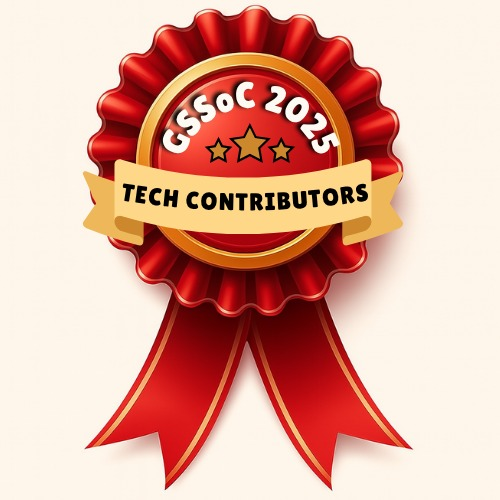
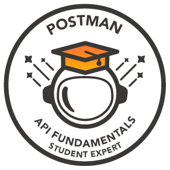

  

  

  
  
  

---

## About

Full-stack developer with hands-on experience building scalable web applications and AI-driven systems.

I build end-to-end applications that combine clean frontend systems with robust backend architectures, and increasingly focus on AI-integrated products and automation-driven solutions.

> Open to internships, collaborations, and impactful problem-solving opportunities.

**B.Tech in Artificial Intelligence & Data Science — Shiv Nadar University, Chennai - CGPA: 9.439**

---

## Tech Stack

### Frontend

  
  
  
  
  
  
  

### Backend & Databases

  
  
  
  
  
  

### AI / ML

  
  
  
  
  
  

### Programming Languages

  
  
  
  

### Tools & Platforms

  
  
  
  
  

---

## Featured Projects

<table>
<tr>
<td width="50%">

### LeftOverLove
**Food redistribution web application**

- Enables users to post and claim surplus food, reducing food waste  
- Real-time listings with filters, expiry tracking, and map-based discovery  

  
  

</td>
<td width="50%">

### Speech to ISL Translator
**Real-time multimodal accessibility system**

- Supports text, audio, video & live speech  
- Grammar-aware NLP for natural translation  

  

</td>
</tr>

<tr>
<td width="50%">

### VidEdu
**AI-powered automated learning platform**

- Converts coding topics into structured video lessons  
- Integrates LLM scripting, animation & audio generation  
- Includes quizzes and adaptive learning  

  

</td>
<td width="50%">

### InternSync
**Internship tracking platform with dashboard workflow**

- Dashboard-based workflow management  
- Real-time tracking and status updates  

  
  

</td>
</tr>
</table>

### Other Projects

| Project | Description | Link |
|---------|-------------|------|
| **Movie Recommendation System** | Content-based recommendation engine using TF-IDF & cosine similarity |   |
| **ShopZ** | Full-stack e-commerce application with cart, checkout & auth |   |
| **Gig Insurance** | Insurance platform for gig workers with AI-driven risk analytics |  |

---

## Badges & Certifications

<table align="center">
<tr>

<td align="center">

</td>

<td align="center">

</td>

<td align="center">

</td>

<td align="center">

</td>

</tr>
</table>

---

## Achievements

- **Winner** – Best First Year Team, CodHer'25 National-Level Hackathon, Anna University, Chennai (among 760+ participants)
- **Winner** – CodeCrunch, MindSpark'25, Sri Ramachandra Faculty of Engineering and Technology
- **Finalist** – Top 8 Teams, South Zone, IIT KGP × SNU Chennai Hackathon

---

## GitHub Stats

  

---

## Positions

  
    
  

---

## Let's Connect

 
  &nbsp;
  
  &nbsp;
  

---

  

